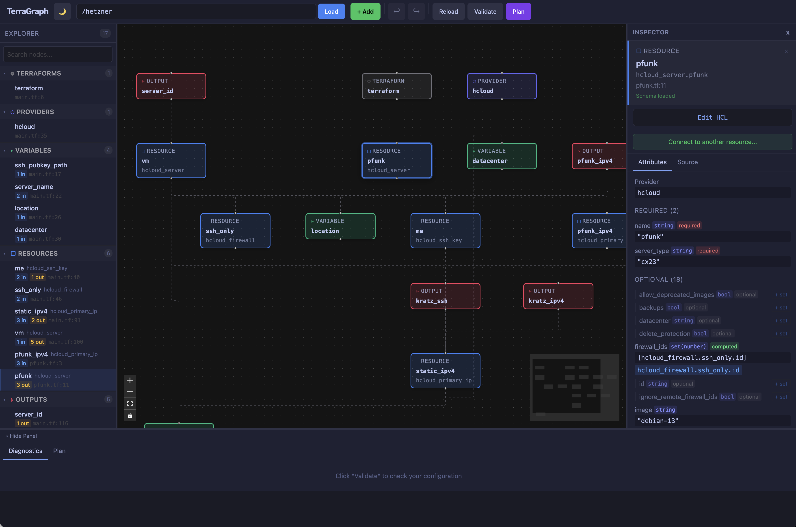

# TerraGraph

A visual Terraform graph editor and inspector. Load any Terraform workspace, visualize resources as an interactive graph, edit HCL through a structured inspector or raw editor, run validation and plan previews, and manage infrastructure visually.



## Architecture

```
terragraph/
  backend/              # Go API server
    cmd/server/         # Entry point
    internal/
      api/              # HTTP handlers (CORS, routing)
      graph/            # Graph node/edge extraction from HCL AST
      parser/           # HCL parsing and patching (hclwrite)
      terraform/        # Terraform CLI integration (validate, plan)
  src/                  # SvelteKit frontend
    lib/
      api.ts            # API client
      layout.ts         # Dagre graph layout
      types.ts          # TypeScript types matching Go backend
      stores/           # Reactive state (Svelte 5 runes)
      components/       # UI components
        GraphCanvas     # Svelte Flow graph rendering
        TerraNode       # Custom node component
        Inspector       # Right panel: attributes, source, plan diff
        BottomPanel     # Diagnostics and plan summary
        Sidebar         # File tree, search, kind filters
        Toolbar         # Workspace path, load/validate/plan actions
    routes/             # SvelteKit pages
  examples/             # Example Terraform workspaces
    simple/             # Single file with vars, locals, resources, outputs
    multi-file/         # Multi-file with provider, data sources, count
```

## Tech Stack

- **Frontend**: SvelteKit, Svelte 5 (runes), Svelte Flow (@xyflow/svelte), Tailwind CSS, dagre
- **Backend**: Go, HashiCorp HCL v2 (hclsyntax + hclwrite), Terraform CLI
- **Build**: Bun, Vite, Go modules
- **Testing**: Vitest, Playwright, Go test

## Setup

### Prerequisites

- [Bun](https://bun.sh/) (package manager)
- [Go](https://go.dev/) 1.21+
- [Terraform](https://www.terraform.io/) CLI

### Install & Run

```bash
# Install frontend dependencies
bun install

# Install Go dependencies
cd backend && go mod tidy && cd ..

# Start backend (port 3001)
cd backend && go run ./cmd/server &

# Start frontend (port 5173, proxies /api to backend)
bun run dev
```

Or use the combined script:

```bash
bun run dev:all
```

Then open http://localhost:5173 and enter a Terraform workspace path.

## Features

### Working

- **Graph visualization**: All Terraform block types rendered as color-coded nodes with dependency edges
- **Dagre auto-layout**: Proper top-to-bottom DAG layout
- **Inspector panel**: Attributes, expressions, references, nested blocks, raw HCL source
- **Inline editing**: Edit simple attribute values in the inspector, patches HCL surgically via hclwrite
- **Sidebar explorer**: File list, node list with search and kind filters
- **Terraform validate**: Run validation and display diagnostics with severity, location, and detail
- **Plan support**: Run `terraform plan`, display plan summary and per-resource action badges (create/update/delete/replace)
- **Plan diff**: Inspector shows before/after field diffs with unknown-after-apply markers
- **Keyboard shortcuts**: Escape to deselect, Cmd+B to toggle sidebar
- **Dark theme**: Professional dark UI

### Supported Terraform Constructs

- Resources, data sources, modules, providers, variables, locals, outputs, terraform blocks
- Expression references (var.x, local.y, resource.type.name.attr)
- depends_on edges
- Nested blocks (ingress/egress rules, filters, etc.)
- count and for_each (parsed and displayed)
- Template strings and function calls (shown as expressions)

### Limitations

- No live LSP integration yet (validates via Terraform CLI)
- No Monaco editor panel yet (raw HCL shown in inspector Source tab)
- No visual resource creation palette yet
- Advanced expressions shown as raw text, not structured editors
- No undo/redo for patches
- Plan requires `terraform init` to have been run in the workspace
- No module expansion (shows module call, not internal resources)

## Development

```bash
# Type check
bun run check

# Lint
bun run lint

# Format
bun run format

# Frontend tests
bun run test:unit

# E2E tests
bun run test:e2e

# Backend tests
cd backend && go test ./...

# Backend build
cd backend && go build ./...
```

## API Endpoints

| Method | Path | Description |
|--------|------|-------------|
| GET | `/api/health` | Health check |
| POST | `/api/workspace/load` | Parse workspace and return graph JSON |
| POST | `/api/workspace/validate` | Run terraform validate |
| POST | `/api/workspace/plan` | Run terraform plan |
| GET | `/api/workspace/file?path=` | Read a file |
| POST | `/api/workspace/patch` | Patch a single attribute in HCL |

## Next Steps

1. Monaco editor panel with HCL syntax highlighting
2. Terraform LSP integration for completions and hover
3. Visual resource creation palette
4. Undo/redo for edits
5. Module expansion
6. Provider schema-driven inspector forms
7. Layout persistence
8. Advanced expression editor
